# Mitschrift Benutzer anlegen

## Maschinen aufsetzen

- Win10 Pro
- 4GB RAM
- 20GB Festplatte für alle User
- eine 10GB Festplatte (Daten) bei PC-Sekretärin 
- Netzwerk (Netzwerkbrücke, 192.168.10.0/24)

## Hostnamen ändern für alle Maschinen

- Befehl: sysdm.cpl
- Hostnamen auf Benutzer des PCs ändern

## Benutzer anlegen

### Chef

- Ein Benutzer Chef als Administrator

### Sekretärin

- Ein Benutzer Admin als Administrator
- Ein Chef Admin als Administrator
- Je ein Benutzer Sekretärin und Mitarbeiter1 bis Mitarbeiter4
- Chef, Sekretärin, MA1-4 zu Gruppe Arbeitsgruppe
- 10GB Festplatte (Daten) einbinden

### Mitarbeiter 1 bis 4

- Ein Benutzer Admin als Administrator
- Ein Benutzer Mitarbeiter(1,2,3,4)

## IP-Adressen vergeben
- Befehl ncpa.cpl
- Chef 192.168.10.1/24
- Sekretärin 192.168.10.2/24
- Mitarbeiter1-4 192.168.10.3 bis 192.168.10.6/24

## Regeln Firewall aktivieren

- Für alle Maschinen und User die Firewall-Regel aktivieren für Datei- und Druckerfreigabe
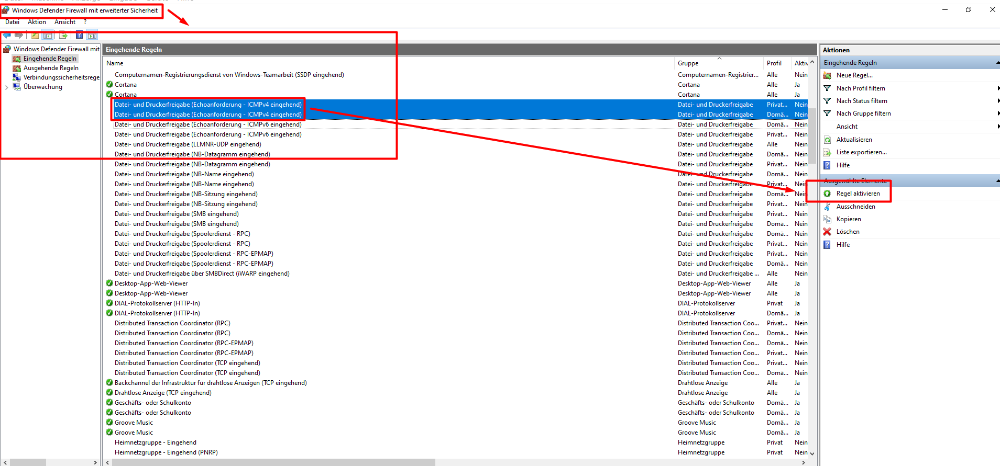

## Freigabe Laufwerk

- Auf der Maschine der Sekretärin als Admin anmelden
- Folgende Ordner als Admin im Laufwerk Daten erstellen
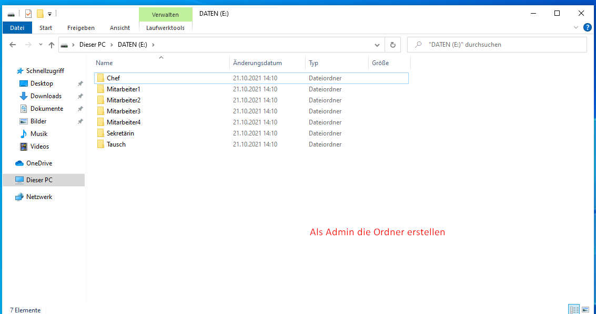
- In die Eigenschaften des Laufwerksdaten auf Freigabe und Erweiterte Eingabe gehen
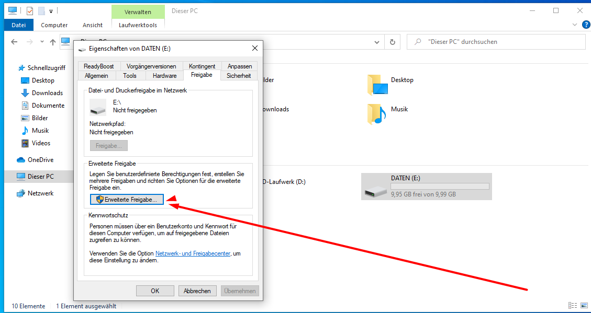
- Hier den Ordner freigeben, auf Berechtigungen und dort die Freigabeberechtigungen für alle Benutzer auf Vollzugriff und Jeder löschen
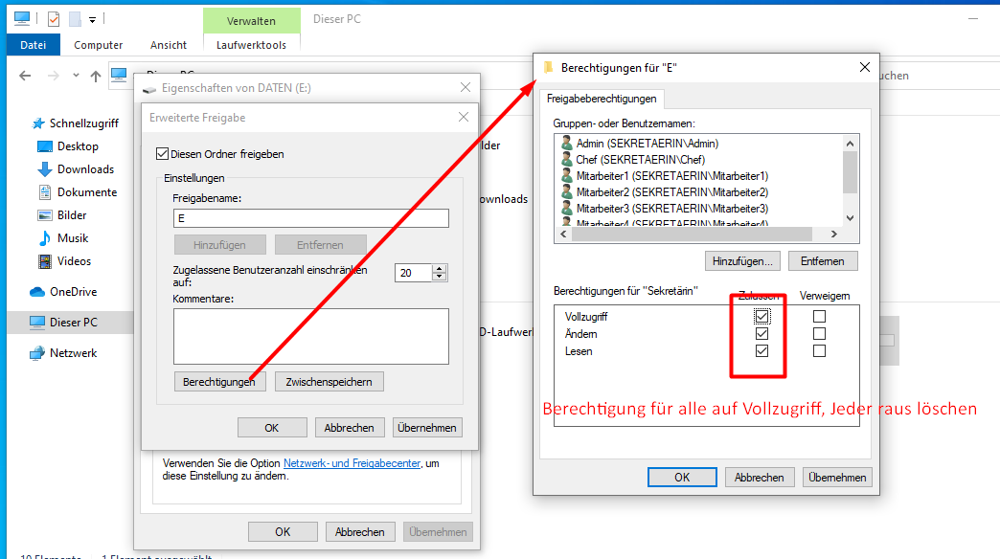
- Zurück in den Eigenschaften auf Sicherheit und dort die Gruppen- und Benutzernamen bearbeiten und die Berechtigungen wie folgt anpassen
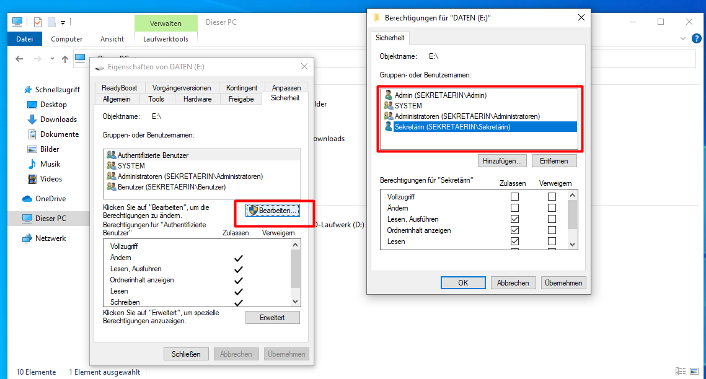
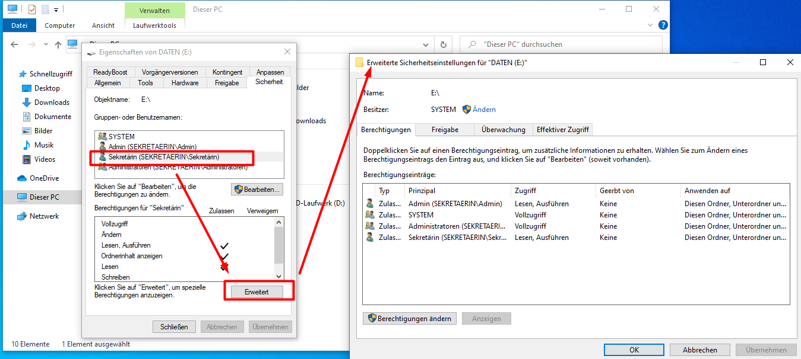
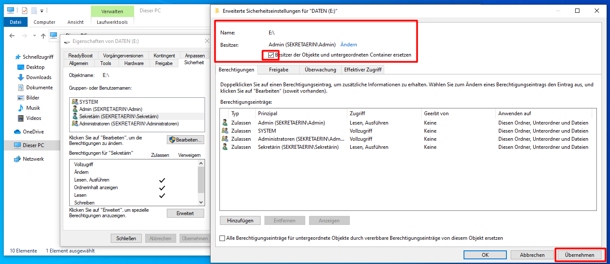
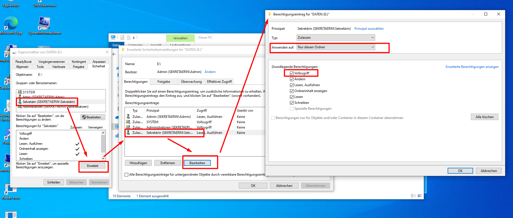
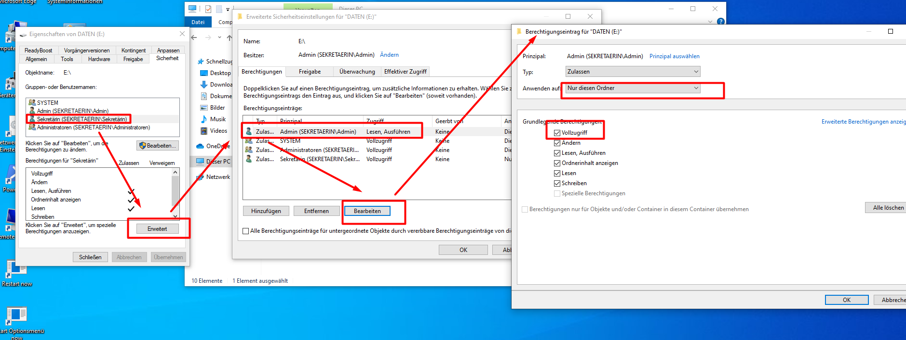

## Freigabe Ordner (Beispiel Chef)
- Im Laufwerk Daten den Ordner Chef wie folgt in den Eigenschaften bearbeiten
- Bei Übernehmen der Änderungen werden Fehler angezeigt. Bricht man diese ab, waren die Änderungen trotzdem erfolgreich
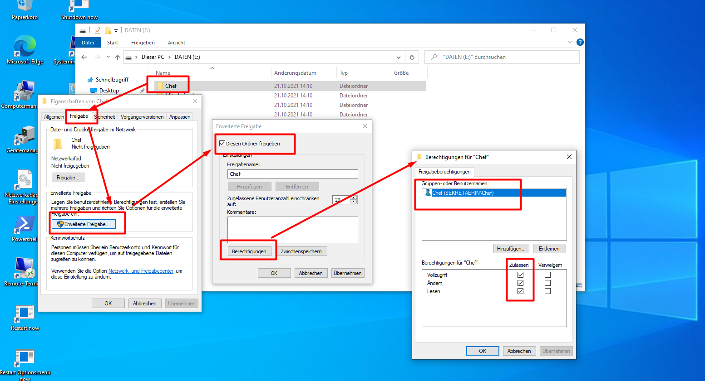
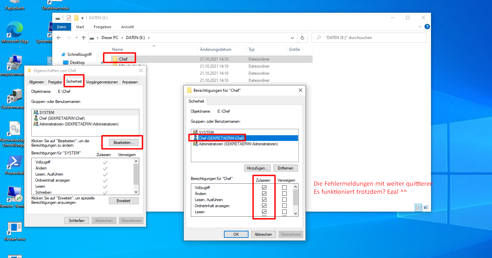

## Netzwerklaufwerke verbinden und testen

- Laufwerke bzw Ordner können wie folgt verbunden werden
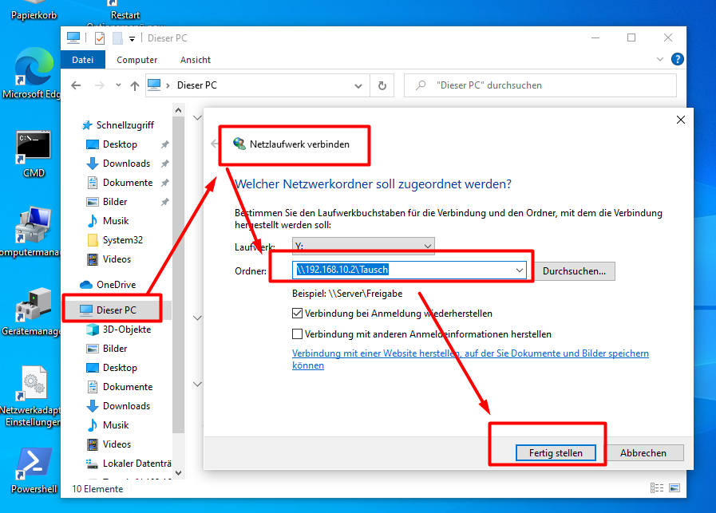
- es sollten nur die Laufwerke bzw Ordner verbunden werden können, welche auf der Festplatte Daten an der Maschine der Sekretärin, die Berechtigungen bekommen haben

### bei PC-Chef

- \\\192.168.10.2\Tausch
- \\\192.168.10.2\Chef

### bei PC-Sekretärin

#### für Sekretärin

- \\\192.168.10.2\Tausch
- \\\192.168.10.2\Sekretärin

#### bei Chef

- \\\192.168.10.2\Tausch
- \\\192.168.10.2\Chef

#### bei Mitarbeiter1-4

- \\\192.168.10.2\Tausch
- \\\192.168.10.2\Mitarbeiter1(2,3,4)

### bei PC-Mitarbeiter1-4

- \\\192.168.10.2\Tausch
- \\\192.168.10.2\Mitarbeiter1(2,3,4)

